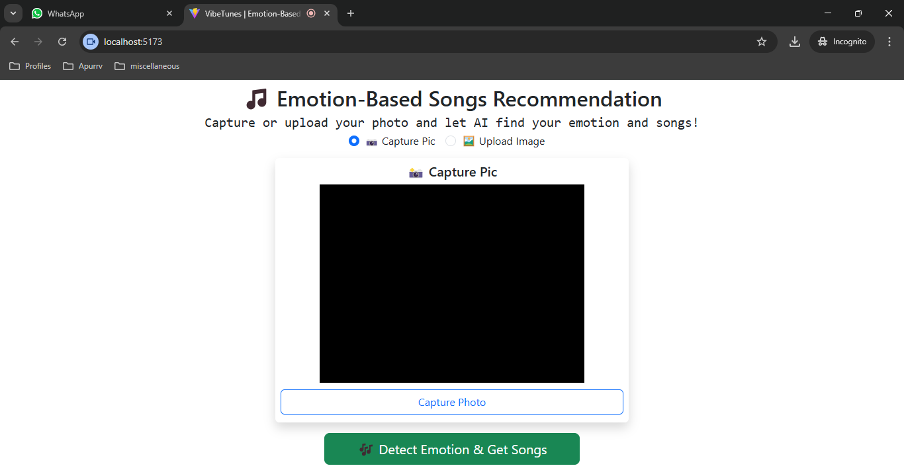

# 🎵 VibeTunes | Emotion-Based Songs Recommendation

A web application that uses facial emotion detection to recommend song genres that match the user's current mood. Powered by DeepFace for emotion recognition, LangChain + Groq for natural language understanding, and YouTube API for songs suggestion.

---

## ✨ Features

- Capture photo from webcam or upload an image
- Detect emotion using facial expression analysis using DeepFace
- Get a matching song genre based on emotion using Meta's Llama
- Automatically fetch songs from YouTube using Youtube API
- Modern React frontend (Vite) + Flask backend

---

## 📸 Screenshots

### Capture or Upload Photo



### Photo Captured


### YouTube Songs Recommendations


---

## 🧰 Tech Stack

- **Frontend**: React (Vite), Axios, Bootstrap, React Webcam
- **Backend**: Flask, Python, DeepFace, LangChain + Groq, Flask-CORS
- **API**: YouTube Data API v3

---

## 🚀 Demo

> [VibeTunes](http://vibetunes-apurrv.netlify.app/)

---

## 🛠️ Local Setup

### 1. Clone the Repository

```bash
git clone https://github.com/iamapurrv/emotion-based-songs-recommendation.git
cd emotion-based-songs-recommendation
````

---

### 2. Backend Setup (Python Flask)

#### Navigate to the `server` directory:

```bash
cd server
```

#### Create a virtual environment and install dependencies:

```bash
python -m venv venv
venv\Scripts\activate
pip install -r requirements.txt
```

#### Create a `.env` file in the `server/` directory:

```env
GROQ_API_KEY=your_groq_api_key
GOOGLE_API_KEY=your_google_api_key
```

#### Run the Flask server:

```bash
python app.py
```

The server will start at `http://localhost:5000`

---

### 3. Frontend Setup (Vite + React)

#### Navigate to the `client` directory:

```bash
cd client
```

#### Install dependencies:

```bash
npm install
```

#### Start the React app:

```bash
npm run dev
```

Frontend will start at `http://localhost:5173`

---

## 🔍 How It Works

1. User captures or uploads a photo.
2. Flask backend uses **DeepFace** to detect emotion from the image.
3. Detected emotion is passed into **LangChain + Groq** to generate a song genres.
4. Flask backend then uses **YouTube API** to search for songs based on the recommended genre.
5. Matching songs are returned to the frontend and displayed in a card-based layout.

---

## 📂 Project Structure

```
Emotion Based songs Recommendation/
├── server/
│   ├── app.py
│   ├── .env
│   ├── requirements.txt
├── client/
│   ├── index.html
│   ├── package.json
│   ├── src/
│   │   ├── App.jsx
│   │   ├── main.jsx
│   │   └── components/
│   │       └── SongByEmotion.jsx
├── screenshots/
```

---

## 📦 Requirements

* Python 3.8+
* Node.js 16+
* Google YouTube Data API key
* Groq API key

---

## ⚠️ Notes

* The model may not detect emotions if the image is blurry or doesn't clearly show a face.
* Groq's LLM (LLaMA3-70B) is used for understanding and matching the emotion to a genre.
* Use a clear, front-facing photo for best results.

---

## 📚 Acknowledgements

* [DeepFace](https://github.com/serengil/deepface)
* [LangChain](https://www.langchain.com/)
* [Groq](https://groq.com/)
* [YouTube Data API](https://developers.google.com/youtube/v3)
